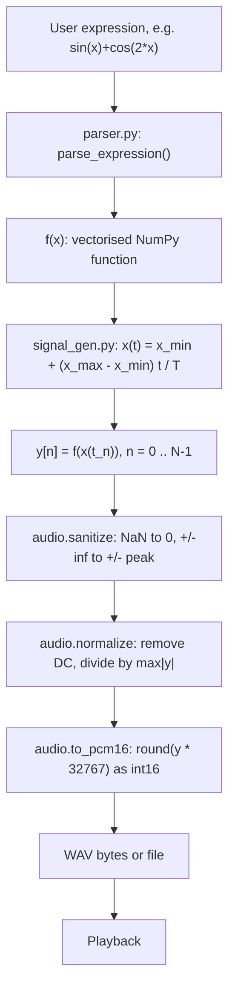
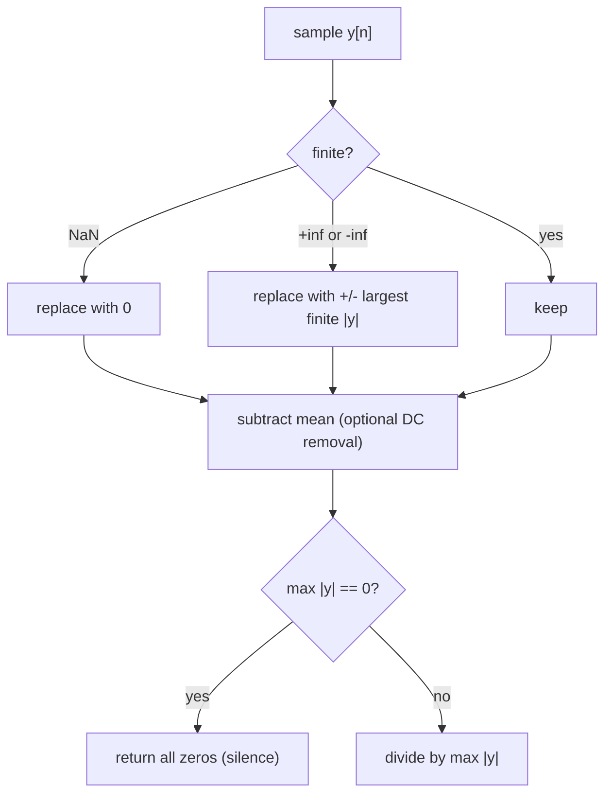
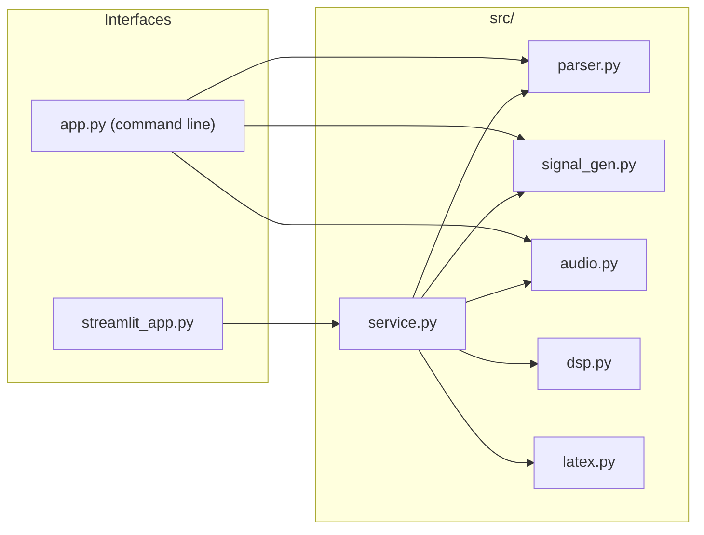
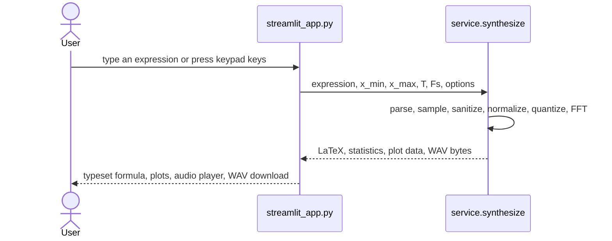

# Math2Sound

Math2Sound turns a mathematical expression into audio. You enter something like `sin(x) + cos(2*x)`, and the program samples it, normalizes it, quantizes it to 16-bit PCM and plays or saves it as a WAV file.

This is a Digital Signal Processing project, not a machine learning one. Every step is explicit NumPy and standard-library code, so each transformation can be studied.

## Pipeline



## Mathematics

An audio signal is a function of time, $y(t)$, but an equation is a function of $x$. The bridge is a linear map from time to $x$:

$$x(t) = x_{min} + (x_{max} - x_{min})\,\frac{t}{T}, \qquad y(t) = f\big(x(t)\big)$$

Digital audio samples this at $F_s$ samples per second:

$$N = F_s T, \qquad t_n = \frac{n}{F_s}, \qquad y[n] = f\big(x(t_n)\big)$$

Example: $f(x)=\sin x$ with $x_{min}=0$ and $x_{max}=2\pi f_0 T$ gives $y(t)=\sin(2\pi f_0 t)$, a pure tone at $f_0$ Hz. In general, `sin(x)` has frequency

$$f_0 = \frac{x_{max} - x_{min}}{2\pi T} \ \text{Hz}$$

Frequencies above the Nyquist frequency $F_s/2$ cannot be represented and alias (fold back down). The Streamlit app warns when this happens.

Normalization and quantization:

$$\hat{y}[n] = \frac{y[n]}{\max_k |y[k]|} \in [-1, 1], \qquad \text{pcm}[n] = \operatorname{round}\big(32767\,\hat{y}[n]\big) \in [-32767, 32767]$$

### Edge cases in sanitizing and normalizing



## Architecture



| Module | Responsibility |
|---|---|
| `src/parser.py` | Safe expression parser built on Python's `ast` module (no `eval`). Returns `f(x)`. |
| `src/signal_gen.py` | Time axis, the $x(t)$ mapping, and sampling $f(x(t))$. |
| `src/audio.py` | Sanitize, normalize, PCM16 conversion, WAV writing, playback. |
| `src/dsp.py` | Hann-windowed FFT spectrum and dominant frequency. |
| `src/latex.py` | Typesets the expression as LaTeX for the formula preview. |
| `src/service.py` | Runs the whole pipeline and returns stats, plot data and WAV bytes. |
| `streamlit_app.py` | Web UI with a typeset preview, keypad, plots and audio player. |
| `app.py` | Command-line interface. |

## Streamlit app flow



## Installation and usage

```bash
pip install -r requirements.txt

streamlit run streamlit_app.py          # web UI

python app.py "sin(x)" --play           # 440 Hz tone for 2 s, written to output.wav
python app.py "x^2" --xmin=-1 --xmax=1 --plot
python app.py "sin(x)+cos(2*x)" --xmax "2*pi*220*2" --out mix.wav

python -m pytest                        # tests
```

Command-line options: `--xmin`, `--xmax` (both accept expressions such as `2*pi*440*2`), `--duration`, `--fs`, `--out`, `--play`, `--plot`.

## Supported syntax

| Kind | Supported |
|---|---|
| Variable | `x` |
| Constants | `pi`, `e` |
| Operators | `+`, `-`, `*`, `/`, `^` (power; `**` also works), unary `-` |
| Functions | `sin`, `cos`, `tan`, `exp`, `log` (natural), `sqrt`, `abs` |

Write multiplication explicitly (`2*x`, not `2x`). Anything outside this list is rejected with an error message.

## Project structure

```
Math2Sound/
  app.py                  command-line interface
  streamlit_app.py        Streamlit UI
  requirements.txt
  src/
    parser.py  signal_gen.py  audio.py  dsp.py  latex.py  service.py
  tests/
    test_all.py  test_service_api_ui.py
```

## Tests

The tests cover the parser (including rejection of unsafe input), the sampling and $x \to t$ mapping, the frequency of `sin(x)` checked with an FFT, normalization edge cases (all zeros, NaN, infinities), PCM and WAV output, the LaTeX typesetter, and the Streamlit app running end to end.
